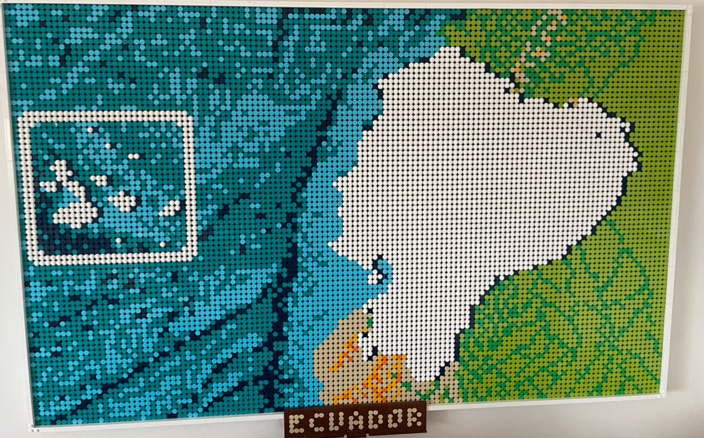

# Pixelation

### Kory Sanchez 

###### Created in 2023

Pixelation is an application which will pixelate images based off of various parameters which can be set in the configuration window.
I originially created this to build a custom LEGO world map. After finishing the world map, I realized I didn't like it, and instead would've preferred a custom image. I photoshopped together something and used this to map the image into lego colored pixels.

Coded purely in python utilizing the standard tkinter toolkit.

### Functionality
- Resizing, pixelation size, padding, distances.
- Pixelation of any input image
- Can find the closest color to actual lego tile color

### Usage

`python3 Pixelation.py`

### Acknowledgments

I've adapted the Infinite Canvas for simple functionality of scrolling over the image.

- [Nordine Lofti](https://stackoverflow.com/users/12349101/nordine-lotfi) - Original idea for the Infinite canvas.
- [Thingamabobs](https://stackoverflow.com/users/13629335/thingamabobs) - Implementation of the Invinite Canvas, which I've simply adapted